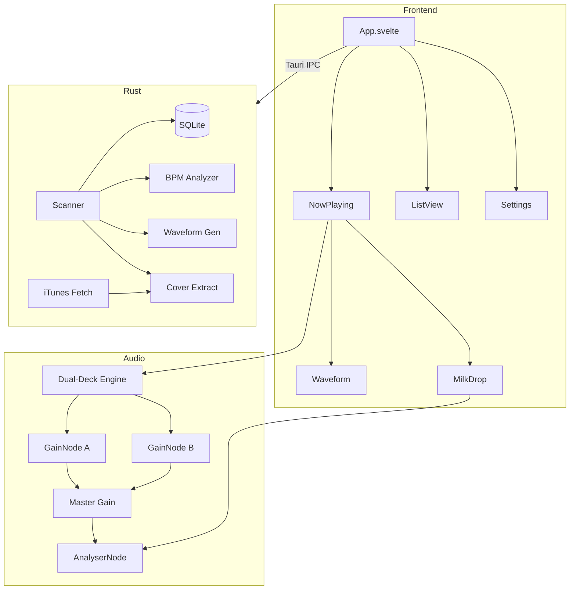

# NX Player

A lightweight, high-performance music player with auto-mixing, MilkDrop visualization, and a mobile-first UI.

Built with **Tauri v2** (Rust) + **Svelte 5** (frontend) — no Electron, no React, no virtual DOM.

## Features

### Playback
- **Dual-deck crossfade engine** — Web Audio API with equal-power gain curves
- **Auto-mix** — automatic crossfading between tracks with configurable duration (0-30s)
- **BPM detection** — energy-based onset analysis with octave correction
- **BPM matching** — adjusts playback rate to sync tempos during crossfade
- **Shuffle with history** — random playback with deterministic back-navigation

### Visualization
- **SoundCloud-style waveform** — pre-computed RMS amplitude bars with dB scaling
- **MilkDrop visualizer** — Butterchurn WebGL rendering with 200+ presets
- **Auto-cycling presets** — configurable interval, click to advance
- **Fullscreen mode** — auto-hiding controls on mouse inactivity

### Library
- **Auto-scan** — detects OS-default music directories on first launch
- **Album cover retrieval** — embedded extraction + iTunes API fallback
- **Optimized cover cache** — resized to 400x400 JPEG
- **SQLite metadata cache** — instant library loading after first scan

### UI
- **3 view modes** — Normal (album art), Mini (compact), MilkDrop (visualizer)
- **Glass controls** — floating bottom bar with backdrop blur
- **Dark/Light themes** — system-aware with manual override
- **Mobile-first layout** — 360px base width, resizable
- **Native macOS integration** — rounded corners, traffic lights, system tray

## Architecture



## Tech Stack

| Layer | Technology | Why |
|-------|-----------|-----|
| Desktop | Tauri v2 | Native webview, ~13MB binary |
| Frontend | Svelte 5 | ~25KB gzipped, no virtual DOM |
| Audio | Web Audio API | Dual-deck crossfade, AnalyserNode |
| Visualizer | Butterchurn | WebGL MilkDrop, 30-90fps |
| Database | rusqlite | Sync SQLite, no async runtime |
| Tags | lofty | Fast metadata for all formats |
| Waveform | symphonia | Rust-native audio decoding |
| Covers | iTunes Search API | Free, no auth, 600x600 |

## Supported Formats

`.mp3` `.m4a` `.aac` `.flac` `.ogg` `.opus` `.wav`

## Building

```bash
pnpm install
pnpm tauri dev      # Dev with hot reload
pnpm tauri build    # Production build
```

## Keyboard Shortcuts

| Key | Action |
|-----|--------|
| Space | Play / Pause |
| Arrow Left/Right | Seek +/-10s |
| Cmd+Left/Right | Previous / Next |
| M | Toggle mini mode |
| V | Cycle view modes |
| F | Fullscreen (MilkDrop) |
| Cmd+L | Toggle library |
| Escape | Back / Exit fullscreen |

## License

MIT - Copyright (c) 2026 Next Rates LLC. See [LICENSE](LICENSE).
